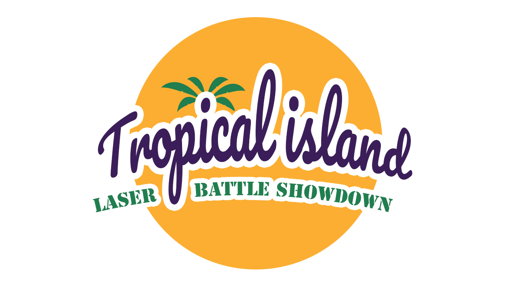
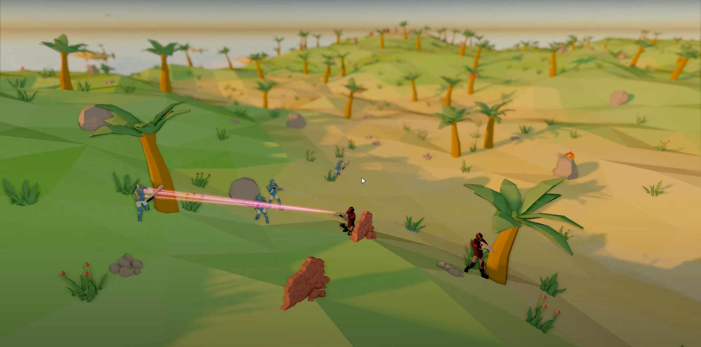

# Tropical Island: Laser Battle Showdown

A Game about Tropical Islands and Laser Battle Showdowns, created for the Game Development Practical of RWTH Aachen.

To build add the following dependencies in `extern/`folder.

* extern/assimp: https://graphics.rwth-aachen.de:9000/ptrettner/assimp-lean
* extern/pcg-cpp/: https://github.com/imneme/pcg-cpp https://www.pcg-random.org/
* extern/glfw: GLFW
* extern/glow: https://gitlab.vci.rwth-aachen.de:9000/Glow
* extern/glow-extras: https://gitlab.vci.rwth-aachen.de:9000/Glow
* extern/polymesh: https://gitlab.vci.rwth-aachen.de:9000/ptrettner/polymesh
* extern/imgui-lean: https://gitlab.vci.rwth-aachen.de:9000/pschmidt/imgui-lean
* extern/typed-geometry: https://gitlab.vci.rwth-aachen.de:9000/ptrettner/typed-geometry

## Building the project (with QtCreator on Linux)

Open `CMakeLists.txt` with `qtcreator`.

A modern QtCreator will ask you to configure the project.
You can choose the compiler (Clang and GCC work) and which targets to build:

* Debug: no optimizations but with full debug information (you should use this as long as it's fast enough)
* RelWithDebInfo: most optimizations but still a lot of debug information
* Release: full optimization and no debug info (you will have a hard time to debug this)

The hammer icon in the bottom-left corner will build your project (shortcut Ctrl-B).

Before you can run the project you have to setup the Working Directory and the command line arguments.
Go to the `Projects` tab (on the left side) and choose `Run` of your current kit (on the top).
The working directory will be `REPO-DIR/bin/(Debug|Release|RelWithDebInfo)/` (depending on your configuration) but you have to *change* it to `REPO-DIR/bin`.

## Building the project (with Visual Studio 2017 (or newer), on Windows)

Requirements:

* Visual Studio 2017 or newer (C++)
* CMake 3.8+

Steps:
* Open CMake-Gui and enter the directory of the source code.
* Now specify where to build the project (this should *not* be inside the git repository).
* Click "Generate", choose "Visual Studio 15 2017 Win64" (or newer version that is also Win64) as the generator.
* Open the .sln file in the build folder with Visual Studio.
* Set GameDevSS21 as the Startup Project (right-click on the project -> Set as StartUp Project)
* Set working directory to the bin folder (right-click project -> Properties -> Debugging -> Working Directory), `$(TargetDir)/../` should work.
* Build the project

# Code Style
## Start of file
* `// SPDX-License-Identifier: MIT`
* for headers: `#pragma once`; for source files, the "primary header" include
  (which is the one whose contents are implemented in this source file)
* standard library includes, alphabetically sorted
* if there were standard library includes and more includes follow: a single empty line
* `extern/` includes, in the following order (which is roughly dependency order): typed-geometry, polymesh, glow, glow-extras, imgui; within each group, sort alphabetically
* if there were standard library or `extern/` includes, and more includes follow: a single empty line
* `src/` includes, first `fwd.hh` if needed, then other headers directly in `src/`, then includes from subdirectories; use `#include "Name.hh"` whenever the header is in the current directory or a subdirectory, otherwise `#include <path/from/src.hh>`; regardless of include style, order each group by full path.
* an empty line
* for source files, optionally a `using namespace` statement followed by an empty line
